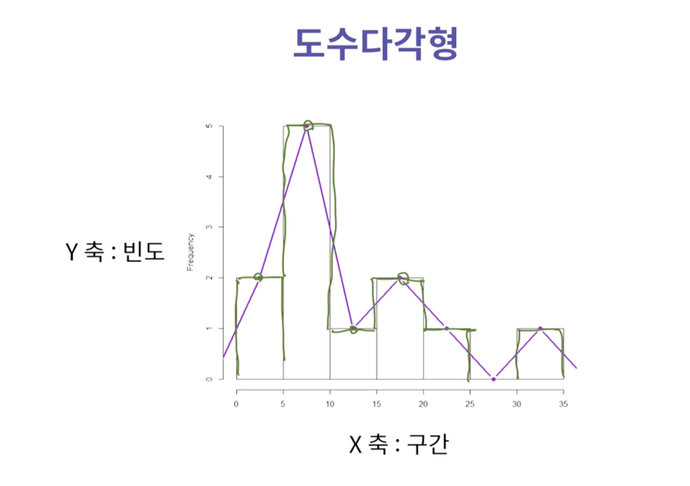
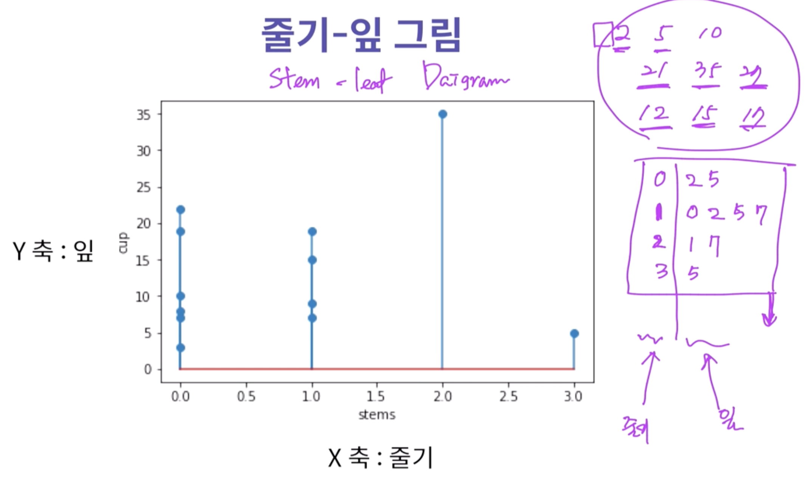

# [이론2] 범주형 자료의 요약.md
## 도수분포표
도수(Frequency): 각 범주에 속하는 관측값의 개수
```python
value_couts()
```

상대도수(Relative Frequency): 도수를 자료의 전체 개수로 나눈 비율
```python
value_counts(normalize=True)
```
- 상대도수의 총 합은 항상 1

도수분포표(Frequency Table): 범주형 자료에서 범주와 그 범주에 대응하는 도수, 상대도수를 나열해 표로 만든 것
- 도수와 함께 상대도수를 넣을 수 있다.
- 몇 개의 범주를 기준으로 둘 것인지에 따라 다양한 도수 분포표 제작 가능

|범주|도수|상대도수|
|---|--|---|
|매우 만족|30|0.3|
|만족|10|0.1|
|보통|30|0.3|
|불만족|15|0.15|
|매우 불만족|15|0.15|
- 도수는 절대값
- 상대도수는 비율
`index`로 설정한 범주에 해당하는 도수를 계산하여 도수분포표를 제작
``` python
pd.crosstab(index = 범주, columns="count")
```
`index`로 설정한 범주와 `colums`로 설정한 범주를 모두 만족하는 도수를 계산하여 도수 분포표를 제작
``` python
pd.crosstab(index = 범주, columns=또 다른 범주)
```

# [이론3] 범주형 자료의 요약:그래프
그래프로 시각화 하는것이 우리에게 훨씬 시각적으로 유용함    
데이터의 특징을 어떤 그래프를 통해 쉽게 보여줄 수 있는가?

## 원형그래프(Pie Chart)
```python
plt.pie(수치, labels = 라벨)
```
숫자의 나열보다 전체적인 분포를 이해하기 쉬운 그래프    
원을 각 범주가 차지하는 비율로 중심각을 나눠 피자처럼 조각을 나눈 형태의 그림
- 장점
  - 전체에서 범주가 차지하는 비율을 파악하기 쉬움
- 단점
  - 범주 간 도수 비교 및 도수 크기 차이 파악이 어려움

## 막대그래프(Bar Chart)
```python
plt.bar(x = 라벨, height = 수치)
```
각 범주에서 도수의 크기를 막대로 그림   
X축: 범주를 나열    
Y축: 도수에 대한 눈금(수치)   
- 장점
  - 각 범주가 가지는 도수의 크기 차이를 비교하기 쉬움
- 단점
  - 각 범주가 차지하는 비율의 비교는 어려움

# [이론4] 수치형 자료의 요약
## 이산형 자료 요약
관련된 수치 자료가 셀 수 있는 경우: 이산형 자료 요약
관측값의 종류 수에 따른 기법 선택
- 많음: 범주형 자료 요약 기법
- 적음: 연속형 자료 요약 기법
  - `stem_leaf` 기법

## 연속형 자료 요약
수치 자료가 연속적으로 관측: 연속형 자료 요약
관측값의 종류 수에 따른 기법 선택
- 많음: 연속형 자료 요약 기법
- 적음: 점도표, 도수분포표, 히스토그램, 상대도수다각형, stem_leaf 그림

## 점도표(dot diagram)
관측값의 개수가 상대적으로 적은 경우(20~25 이하) 사용
- 자료 전체의 개요를 파악 가능
- 모든 자료를 나타낼 수 있도록 줄 위에 각 관측값에 해당되는 점을 찍어 표시

연속형 자료의 경우 **중복된 정보**를 판단하기 어려움 -> 자료를 크기에 따라 묶어서 분석하는 것이 **효율적**

## 도수분포표(Frequency Table)
각 관측값에 대한 도수를 측정하여 도수분포표 작성
연속형 자료의 경우 다수의 구간(계급)으로 나누고 각 구간마다 관측값의 개수(도수)로 작성
- 계급(Class)
  - 모든 연속형 자료의 범위를 나눈 구간
- 계급구간
  - 각 계급에 포함되는 값의 범위
- 계급구간의 폭
  - 계급구간의 크기

### 도수분포표 작성 순서
1. 자료의 범위: 자료에서 최댓값과 최솟값을 찾아 자료의 범위를 구함
2. 계급의 폭: 계급의 개수를 분포의 경향이 잘 드러날 수 있도록 정함
   - 보통 root(N)+-3 정도로 계급의 개수를 정함
   - 가장 중요한건 계급의 개수를 가장 잘 표현할 수 있는 숫자가 있으면 그걸로 정함
3. 계급구간: 모든 관측 값을 포함하도록 계급구간의 경계점을 구함
4. 도수: 각 계급구간에 속하는 관측값의 개수를 세어 계급의 도수를 더함
5. 상대도수: 각 게급의 도수를 전체 관측값의 개수로 나눠 계급의 상대도수를 구함

# [이론5] 수치형 자료의 요약: 그래프
## 히스토그램(Histogram)
X축: 계급<br>
Y축: 빈도
```python
plt.hist()
```
연속형 자료의 도수분포표를 기반으로 각 계급을 범주처럼 사용<br>
범주형 자료의 막대그래프와 같은 방식으로 그림<br>
도수비교
- 범주: 막대그래프
- 연속: 히스토그램

특징
- 자료의 분포를 알 수 있음
- 계급구간과 막대의 높이로 그림
- 모든 계급구간의 폭이 같으면 도수, 상대도수를 막대 높이로 사용

## 도수 다각형
히스토그램에 약간의 변형을 통해 만듬

### 도수 다각형 특징
- 각 계급구간의 중앙에 점을 찍어 직선으로 연결함
- 관측값의 집중된 위치, 정도, 치우친 정도, 꼬리의두터움 등 분포의 상태를 쉽게 파악
- 관측값의 변화에 따라 도수 또는 상대도수의 변화를 잘 나타냄

### 도수다각형과 히스토그램
- 히스토그램
  - 옆으로 나열하여 자료 비교
- 도수다각형
  - 꺾은선으로 표시하여 자료 비교

여러 자료를 비교하기 위해서는 히스토그램보다 도수다각형이 알맞음<br>

## 줄기 잎 그림(stem_leaf Daigram)
데이터의 개수가 비교적 많지 않을 때 텍스트로 표처럼 보여주는 방식<br>
Y축: 잎 <br>
X축: 줄기 <br>
일반적으로 10단위로 짤라서 줄기(10단위), 잎(1단위)로 표현<br>

이걸 그나마 비슷하게 그려주는 `stem` 함수 사용

### 줄기-잎 그림 자료 정리 방법
1. 관측값을 보고 앞 단위와 뒷 단위를 정함
2. 앞 단위를 줄기로 하여 세로로 배열하고 수직선을 그림
3. 뒷 단위를 잎으로 하여 관측값을 앞 단위 오른쪽에 오름차순 기입

### 줄기-잎 그림 함수
```python
plt.stem(줄기, 관측 값)
```
장점
- 자료의 분포를 시각적으로 쉽게 파악
- 각 관측값도 유지 가능
함수 사용 시에 줄기 값을 따로 지정해줘야 함
- 줄기를 데이터마다 다르게 설정할 수 있기 때문

### 줄기-잎 그림 장단점
- 장점
  - 관측값을 보여주므로 최댓값, 최솟값 등의 위치 파악 쉬움
  - 순서대로 배열된 관측값의 장점과 히스토그램의 장점을 모두 가지고 있음
  - 그리기 쉬움
- 단점
  - 관측값의 개수가 많은 경우 제산호니 공간에 그리기 불가능
  - 관측값이 지나치게 흔처져 있으면 부적절


